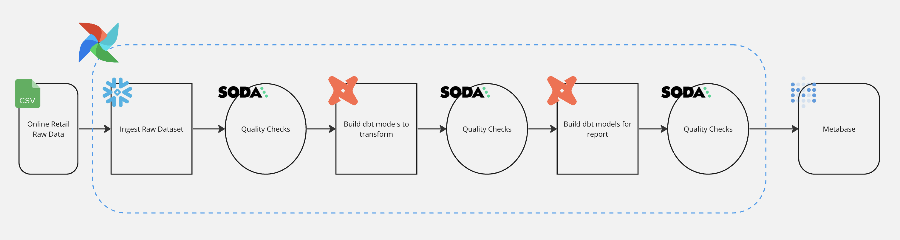
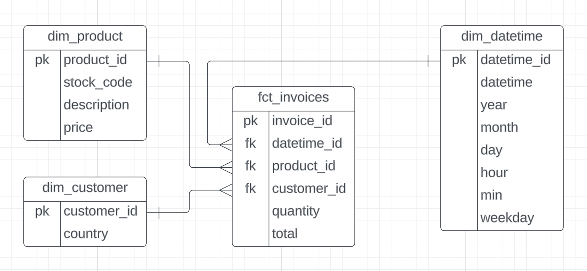
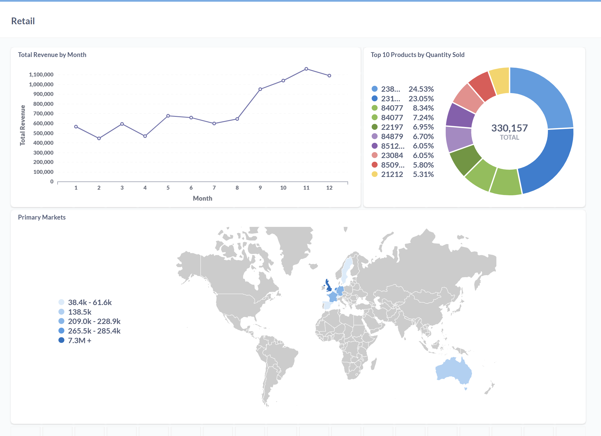

# Retail_Airflow_Project

Welcome to the **Retail Airflow Project** powered by **Astronomer**! This project is designed to manage and orchestrate data workflows for retail operations using **Apache Airflow**, integrated with **DBT** for data transformations and **Soda** for data quality checks. This README outlines the project structure and how to run it locally using the Astronomer CLI.

---

# Dataset

The dataset used in this project is from Kaggle:

[Online Retail Dataset](https://www.kaggle.com/datasets/tunguz/online-retail)

# Online Retail Data Pipeline


## Overview
This repository contains an end-to-end data pipeline designed to process online retail raw data into analytical-ready insights through a series of data quality checks and transformations.

## Architecture
The pipeline follows a modern data stack approach with the following components:

- Data Source: Online retail transaction data in CSV format
- Data Ingestion: Raw dataset ingestion process using Snowflake
- Data Quality: SODA checks at multiple stages to ensure data integrity
- Data Transformation: dbt models for both data transformation and reporting
- Data Visualization: Metabase for end-user analytics and dashboarding
- Orchestration: Google Cloud Composer (Airflow) for workflow management

## Pipeline Flow

- Online retail raw data (CSV) is loaded into the system
- The ingestion process moves data into Snowflake
- Initial SODA quality checks validate the raw data
- dbt models transform the data into a structured format
- Second SODA quality checks validate the transformed data
- Additional dbt models prepare data specifically for reporting needs
- Final SODA quality checks ensure reporting data meets quality standards
- Transformed and validated data is made available in Metabase

# Online Retail Data Modeling


## Data Warehouse Schema
The data is modeled in a star schema design with the following structure:
Fact Table

### fct_invoices: Contains transactional data with measures such as quantity and total, linked to dimension tables via foreign keys

- Primary Key: invoice_id
- Foreign Keys: datetime_id, product_id, customer_id
- Measures: quantity, total
- 
### Dimension Tables

- dim_product: Product dimension with details about each product
    - Primary Key: product_id
    - Attributes: stock_code, description, price


- dim_customer: Customer dimension with customer information
    - Primary Key: customer_id
    - Attributes: country

- dim_datetime: Time dimension with date/time hierarchies

    - Primary Key: datetime_id
    - Attributes: datetime, year, month, day, hour, min, weekday

This schema supports flexible querying across multiple dimensions for analytics purposes.

# Result Dashboard


## 📁 Project Contents

Your Astro project contains the following key components:

- **`dags/`**: Contains your Airflow DAGs. You can place your retail-specific DAGs here. Currently includes an example DAG:
  - `example_astronauts.py`: Sample ETL DAG using TaskFlow API and dynamic task mapping (can be removed or replaced).
- **`include/`**: Place any custom scripts, DBT models, Soda checks, or assets here.
  - Suggested layout:
    - `include/dbt/models/`: DBT SQL models for retail transformations.
    - `include/soda/checks/`: YAML files with Soda data quality checks.
- **`plugins/`**: Add custom or community Airflow plugins here.
- **`Dockerfile`**: Defines the runtime environment based on the Astro Runtime image.
- **`packages.txt`**: Install system-level dependencies (optional).
- **`requirements.txt`**: Python dependencies for DBT, Soda, or any custom logic.
- **`airflow_settings.yaml`**: Define Airflow Connections, Variables, and Pools locally.
- **`.env`** (optional): Store environment-specific variables, such as GCP credentials or API keys (ignored by Git).

---

## 🧑‍💻 Running Airflow Locally

To start Airflow with Astronomer:

```bash
astro dev start
```

---

## DBT Integration
To run DBT models inside your project:
```bash
cd include/dbt
dbt run
```
Ensure that both profiles.yml and dbt_project.yml are configured properly in the include/dbt/ directory.

---

## 📦 DBT Integration
DBT (Data Build Tool) is used for transforming your raw data into clean, structured data. To integrate DBT into your project:

### 1.Install DBT dependencies in your local environment:

```bash
pip install dbt
```
## 2.Configure DBT:

- Navigate to the include/dbt/ directory in the project.
- Configure the profiles.yml and dbt_project.yml files to match your data warehouse credentials and project settings.

## 3.Run DBT Models:

In the include/dbt/ directory, run the following command to execute the transformations defined in your DBT models:

```bash
astro dev bash
source /usr/local/airflow/dbt_venv/bin/activate
cd include/dbt 
dbt deps
dbt run --profiles-dir /usr/local/airflow/include/dbt/
```
This command will execute the transformations for all the models defined in your DBT project.

Check DBT Logs:

After running DBT, check the logs to ensure the models ran successfully. Logs are typically located in the logs/ directory, and any errors during execution will be printed there.

Make sure that your data warehouse is set up and accessible from the environment where you're running DBT.

---

## Soda Integration for Data Quality Monitoring
Soda is a tool that helps ensure data quality by checking for issues such as missing values, duplicates, and inconsistencies in your data warehouse. Follow the steps below to integrate and run Soda in your project.

### 1. Install Soda Dependencies
To use Soda, you need to install its dependencies in your local environment:

``` bash
pip install soda-sql
```
### 2. Configure Soda
Once Soda is installed, you need to set up the necessary configuration files:
- Place your data quality checks in the include/soda/checks/ directory.
- Create a configuration file (soda_config.yml) in the include/soda/ directory. Ensure this file contains the correct connection details for your data warehouse.

### 3. Run Soda Data Quality Checks
To scan your data for quality issues, navigate to the include/soda/ directory and run the following command:
```bash
cd /usr/local/airflow
source /usr/local/airflow/soda_venv/bin/activate
soda scan -d retail -c include/soda/configuration.yml include/soda/checks/report/*
```
This command will initiate the scan and check your data for any quality issues.

### 4. Review Soda Results
Once the scan is complete, review the results outputted in the terminal. Soda will provide feedback on any data quality issues it finds. Use this feedback to troubleshoot and fix any issues in your data warehouse.


